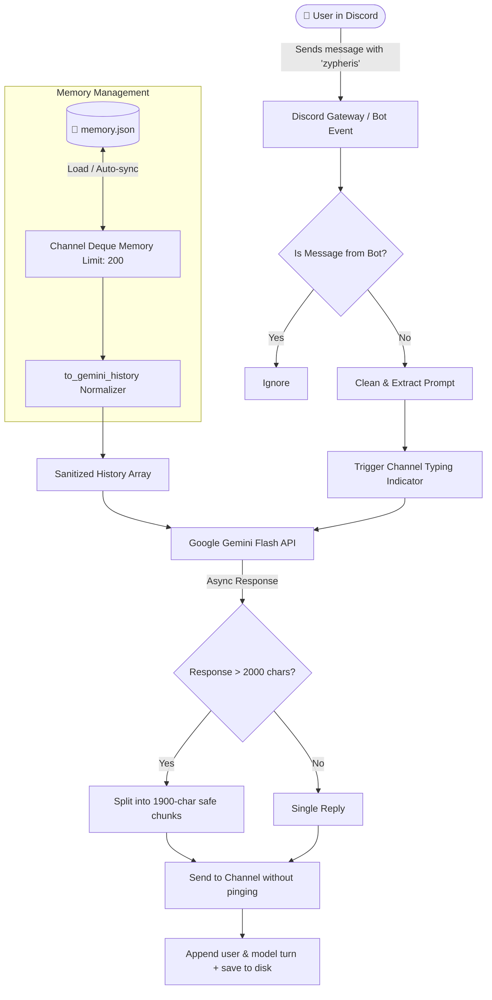

<div align="center">

# ⚡ ZYPHERIS
### *I Gave Google Gemini A Persistent Memory & A Discord Server... AND THIS HAPPENED! 🧠🔥*

[](https://python.org)
[](https://discordpy.readthedocs.io/)
[](https://aistudio.google.com/)
[](LICENSE)
[](#)

<p align="center">
  <b>Forget dumb rule-based bots. Meet Zypheris — a next-generation Discord AI companion equipped with long-term conversational memory, asynchronous neural streaming, and automated context sanitization.</b>
</p>

[Quickstart](#-quickstart-in-3-minutes) • [Under The Hood](#-the-secret-sauce-under-the-hood-deep-dive) • [Architecture](#-system-architecture) • [Discord Setup](#-step-by-step-discord-developer-setup) • [GitHub Push Guide](#-how-to-push-this-project-to-github)

---

</div>

## 🚨 The Problem With Most Discord Bots
Most AI Discord bots are **amnesiacs**. Every time you send a message, they forget who you are, what you were discussing 10 seconds ago, and hallucinate wildly. Even worse, they block the Discord gateway loop, crash on consecutive messages, and get choked by Discord's rigid 2,000-character message limit.

**Zypheris fixes all of that.**

---

## ⚡ What Makes Zypheris Built Different?

- 🧠 **Persistent Sliding-Window Memory (200-Message Deque)**: Conversations are persistently saved to disk per-channel. Zypheris remembers context across bot reboots!
- 🛡️ **Zero-Crash Gemini Role Normalizer**: Google Gemini enforces strict alternating roles (`user` ↔ `model`). Zypheris features an automated history sanitation engine that stitches disjointed messages and purges invalid states before sending.
- ⚡ **Non-Blocking Asynchronous Engine**: Uses `send_message_async` inside Discord's native `typing()` context so your server never lags or drops gateway heartbeats.
- ✂️ **Infinite Response Chunking**: Discord cuts off messages at 2,000 characters. Zypheris automatically slices responses into 1,900-character chunks without clipping words or losing replies.
- 🎯 **Frictionless Trigger Detection**: No annoying command prefixes required. Mention `zypheris` anywhere in the sentence and the bot extracts your prompt intelligently.

---

## 🏗️ System Architecture



---

## 🔬 The "Secret Sauce": Under The Hood Deep Dive

Bringing an LLM into a high-concurrency real-time chat platform like Discord requires solving 4 major computer science and API integration problems:

### 1. The Asynchronous Event Loop & Heartbeats
Discord bots communicate via persistent WebSockets (Discord Gateway). If you make a synchronous network call to an AI API that takes 2–5 seconds, the bot freezes, gateway pings fail, and Discord forcibly disconnects the bot.
* **Zypheris Solution**: Fully asynchronous execution using `model.start_chat()` and `await chat.send_message_async(prompt)` coupled with `async with message.channel.typing()`.

### 2. The Gemini Strict Alternating Role Protocol
Google's Generative AI API throws fatal `400 Bad Request` exceptions if chat history violates alternating order:
1. History MUST start with role `user`.
2. History MUST alternate: `user` ➔ `model` ➔ `user` ➔ `model`.
3. History CANNOT have duplicate adjacent roles or end with a `user` turn before sending a new prompt.
* **Zypheris Solution**: The custom `to_gemini_history()` algorithm traverses historical turns, merges consecutive messages from the same role into unified parts, and pops dangling user turns so Gemini always receives pristine dialog states.

### 3. High-Performance Sliding Memory with O(1) Operations
Storing infinite messages causes memory bloat and context exhaustion.
* **Zypheris Solution**: Python’s `collections.deque(maxlen=200)` provides an $O(1)$ constant time complexity sliding buffer. When the 201st message arrives, the oldest message drops off automatically with zero performance penalty.

### 4. 2000-Character Discord Wall Bypass
Discord hard-limits single messages to 2,000 characters. Detailed AI coding answers or essays frequently exceed 3,000+ characters.
* **Zypheris Solution**: Slices responses into 1,900-character segments. The primary chunk is sent as a contextual `message.reply()`, and remaining chunks stream cleanly into the channel.

---

## 🚀 Quickstart in 3 Minutes

### 1. Clone & Enter Directory
```bash
git clone https://github.com/YOUR_USERNAME/zypheris-ai-bot.git
cd zypheris-ai-bot
```

### 2. Create Virtual Environment & Install Dependencies
```bash
# Windows
python -m venv venv
venv\Scripts\activate

# Linux / macOS
python3 -m venv venv
source venv/bin/activate

# Install dependencies
pip install -r requirements.txt
```

### 3. Configure Your Environment Variables
Copy `.env.example` to `.env`:
```bash
# Windows (PowerShell)
Copy-Item .env.example .env

# Linux / macOS
cp .env.example .env
```

Open `.env` and fill in your keys:
```ini
DISCORD_TOKEN=your_discord_bot_token_here
GEMINI_API_KEY=your_gemini_api_key_here
OWNER_NAME=YourName
```

### 4. Unleash Zypheris!
```bash
python zypheris.py
```

---

## 🔑 Step-by-Step Discord Developer Setup

1. Head over to the **[Discord Developer Portal](https://discord.com/developers/applications)**.
2. Click **New Application** and name it **Zypheris**.
3. Go to the **Bot** tab on the left sidebar:
   - Click **Reset Token** to copy your bot token (paste this in `.env` as `DISCORD_TOKEN`).
   - Scroll down to **Privileged Gateway Intents** and enable:
     - ✅ **Message Content Intent** (CRITICAL: without this, the bot cannot read triggers!)
     - ✅ **Server Members Intent**
4. Go to **OAuth2 ➔ URL Generator**:
   - Scopes: Select `bot`.
   - Bot Permissions: Select `Send Messages`, `Read Message History`, `Send Messages in Threads`, `Add Reactions`.
5. Copy the generated invite link at the bottom and paste it in your browser to invite Zypheris to your server!

---

## 💎 Getting Your Free Google Gemini API Key

1. Visit **[Google AI Studio](https://aistudio.google.com/)**.
2. Sign in with your Google account.
3. Click **Get API key** ➔ **Create API key in new project**.
4. Copy your key and place it into `.env` as `GEMINI_API_KEY`.

---

## 📦 How to Push This Project to GitHub

Here is the exact terminal walkthrough to publish your bot repository safely without leaking your keys:

```bash
# 1. Navigate to your bot folder
cd c:\Users\cosmo\Documents\anderson\discord.bot

# 2. Initialize git repository
git init

# 3. Double-check git status (.env and memory.json MUST NOT be tracked!)
git status

# 4. Stage all files
git add .

# 5. Commit your files
git commit -m "feat: initial commit for Zypheris AI Discord Bot with persistent memory"

# 6. Set main branch
git branch -M main

# 7. Link to your GitHub repository (Create a new empty repo on github.com first)
git remote add origin https://github.com/YOUR_GITHUB_USERNAME/YOUR_REPOSITORY_NAME.git

# 8. Push to GitHub!
git push -u origin main
```

> [!WARNING]
> Never remove `.env` from your `.gitignore`. If you accidentally push your `.env` file to a public repository, Discord and Google will automatically invalidate your tokens within seconds for security reasons!

---

## 🛠️ Tech Stack & Libraries Used

| Technology | Purpose |
| :--- | :--- |
| **Python 3.10+** | Core programming language |
| **[discord.py](https://github.com/Rapptz/discord.py)** | High-level async Discord Gateway API wrapper |
| **[google-generativeai](https://github.com/google/generative-ai-python)** | Official SDK for Google Gemini multimodal LLMs |
| **[python-dotenv](https://github.com/theskumar/python-dotenv)** | Secure zero-leak environment variable loading |
| **Collections Deque** | Double-ended queue for memory buffers |
| **JSON Serialization** | Persistent local disk storage engine |

---

## 🤝 Contributing
Contributions, issues, and feature requests are welcome! Feel free to check the [issues page](https://github.com/YOUR_USERNAME/zypheris-ai-bot/issues).

## 📄 License
This project is licensed under the MIT License - see the [LICENSE](LICENSE) file for details.

<div align="center">
  <b>Built with ❤️ by your friendly neighborhood AI enthusiast. If Zypheris leveled up your Discord, leave a ⭐ on GitHub!</b>
</div>
